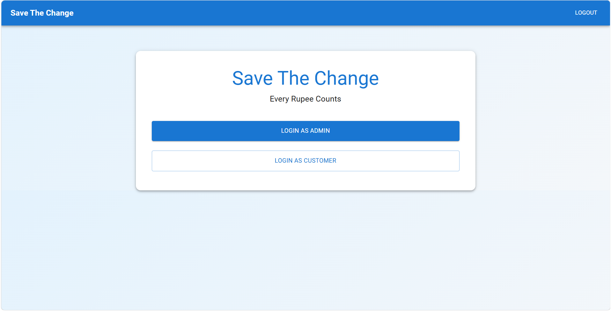
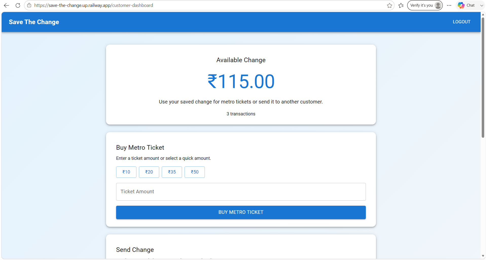
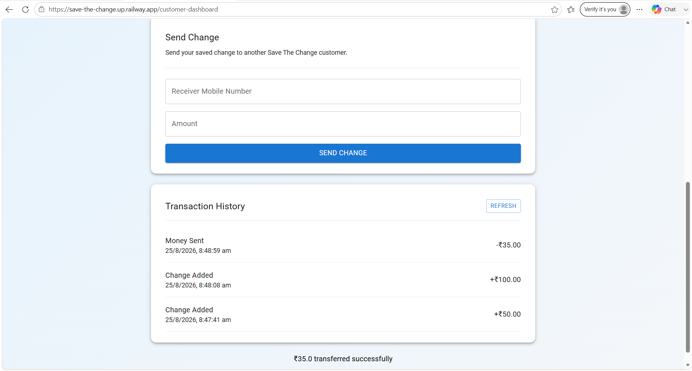
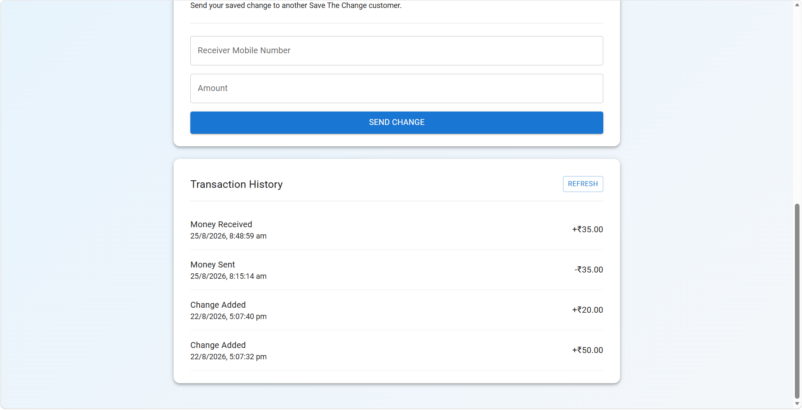
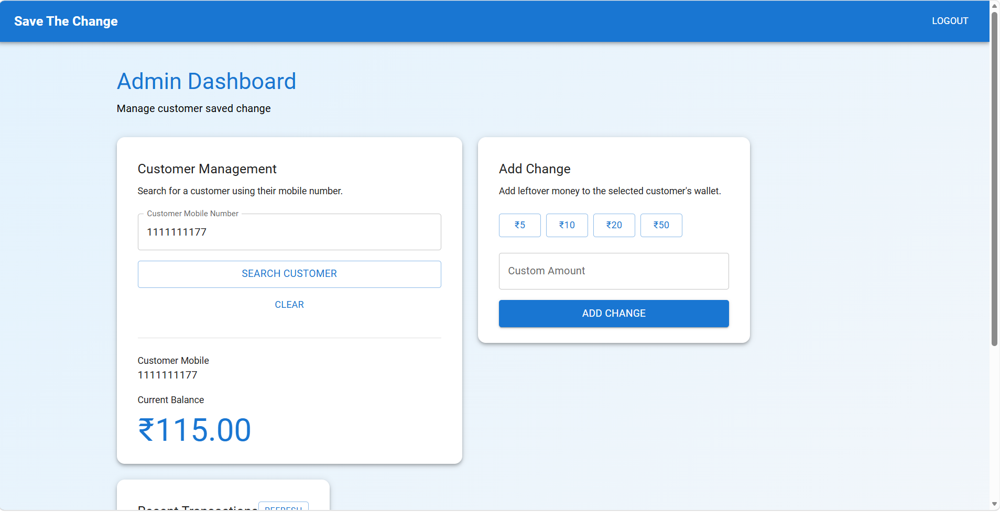
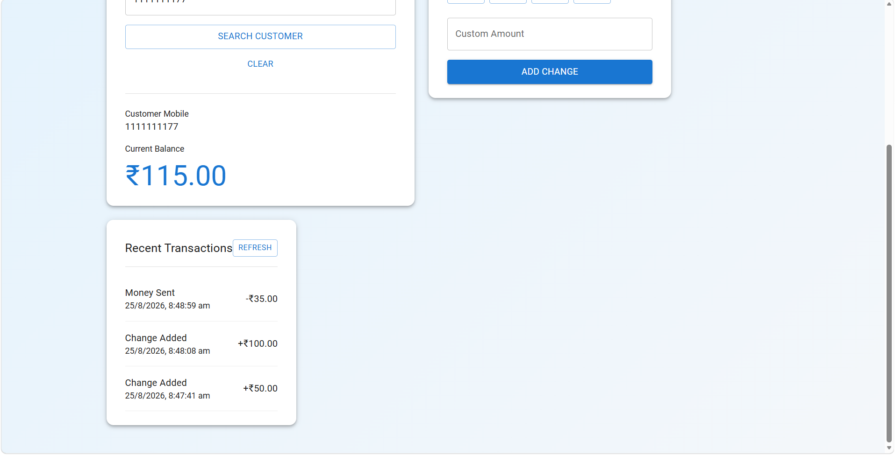

# Save The Change

## Digital Leftover-Change Management System

Save The Change is a full-stack web application that digitally stores leftover change from everyday transactions and allows customers to use their saved balance for metro tickets or transfer it to another customer.

## Live Deployment

- Frontend: https://save-the-change.up.railway.app/
- Backend API: https://save-the-change-production.up.railway.app/

## Key Features

- Customer registration and login
- Admin login
- Unique mobile-number validation
- Customer balance management
- Admin customer search
- Admin can add leftover change
- Quick change amounts
- Custom change amount
- Metro ticket purchase
- Quick metro ticket amounts
- Custom ticket amount
- Money transfer between customers
- Receiver validation
- Insufficient-balance validation
- Transaction history
- Money sent and money received records
- Change-added transaction records
- Customer and admin dashboards
- Logout functionality
- Persistent data using MySQL
- Cloud deployment using Railway

## Technology Stack

**Frontend:** React.js, JavaScript, Axios, React Router, Material UI (MUI)

**Backend:** Java, Spring Boot, Spring Data JPA, Hibernate, REST API

**Database:** MySQL

**Deployment:** Railway

**Tools:** VS Code, Git, GitHub, Postman

## Application Workflow

```text
                         Save The Change
                                ↓
                    ┌───────────┴───────────┐
                    ↓                       ↓
                 Admin                  Customer
                    ↓                       ↓
               Admin Login           Register / Login
                    ↓                       ↓
             Search Customer          Customer Dashboard
                    ↓                       ↓
              Add Change          ┌───────┼────────┐
                    ↓              ↓       ↓        ↓
             Customer Balance    Ticket   Send   History
                                  Purchase Change
                                      ↓       ↓
                                      └───┬───┘
                                          ↓
                                     MySQL Database
```

# Screenshots

## Home Page



## Customer Registration


## Customer Dashboard



## Buy Metro Ticket


## Send Change



## Customer Transaction History



## Admin Dashboard



## Admin Transaction Management



## Project Structure

```text
Save-The-Change/
├── backend/
│   ├── src/
│   │   └── main/
│   │       ├── java/
│   │       └── resources/
│   ├── pom.xml
│   └── ...
├── frontend/
│   ├── public/
│   ├── src/
│   │   ├── components/
│   │   ├── pages/
│   │   └── ...
│   ├── package.json
│   └── ...
├── screenshots/
│   ├── home.png
│   ├── customer-registration.png
│   ├── customer-dashboard.png
│   ├── buy-ticket.png
│   ├── send-change.png
│   ├── customer-history.png
│   ├── admin-dashboard.png
│   └── admin-transactions.png
└── README.md
```

## Local Setup

### Clone the Repository

```bash
git clone https://github.com/Srinivas5670/save-the-change.git
cd Save-The-Change
```

### Backend Setup

Open a terminal in the backend directory:

```bash
cd backend
```

Build the Spring Boot application:

```bash
mvn clean package
```

Run the backend:

```bash
mvn spring-boot:run
```

The backend runs on port `8080`.

### Frontend Setup

Open another terminal:

```bash
cd frontend
npm install
npm start
```

The React development server will start on the local address provided by React.

## Database

The application uses MySQL for persistent storage.

The database stores customer information such as:

- Mobile number
- Password
- Balance

It also stores transaction records for operations such as:

- Change Added
- Money Sent
- Money Received
- Metro Ticket

For local development, configure the Spring Boot database properties according to your local MySQL installation.

## Main Modules

### Customer Module

Customers can:

1. Register using a mobile number and password.
2. Login to their account.
3. View their saved-change balance.
4. Buy metro tickets.
5. Transfer change to another customer.
6. View transaction history.

### Admin Module

Administrators can:

1. Login to the admin dashboard.
2. Search customers by mobile number.
3. View customer balances.
4. Add leftover change to customer accounts.
5. View recent transactions.

## API Overview

| Endpoint | Method | Purpose |
|---|---|---|
| `/api/customer/register` | POST | Register customer |
| `/api/customer/login` | POST | Customer login |
| `/api/customer/profile/{mobileNumber}` | GET | Get customer profile |
| `/api/customer/transactions/{mobileNumber}` | GET | Get customer transactions |
| `/api/customer/transfer` | POST | Transfer change |
| `/api/customer/ticket` | POST | Buy metro ticket |
| `/api/admin/register` | POST | Register admin |
| `/api/admin/login` | POST | Admin login |

## Deployment Architecture

```text
React Frontend
      │
      │ REST API / Axios
      ↓
Spring Boot Backend
      │
      │ JPA / Hibernate
      ↓
MySQL Database
      │
      └── Railway
```

## Validation and Error Handling

The application handles common cases including:

- Invalid mobile number
- Duplicate customer registration
- Invalid password
- Password confirmation mismatch
- Customer not found
- Invalid transfer amount
- Insufficient balance
- Invalid ticket amount
- Attempt to transfer to the same customer

## Future Enhancements

- OTP-based mobile verification
- Secure password hashing
- JWT-based authentication
- Role-based authorization
- Password reset
- QR-code based transfers
- Real metro ticket integration
- Payment gateway integration
- Notifications
- Advanced admin analytics
- Mobile application

## Project Status

**Completed and Deployed**

The main customer and administrator workflows have been implemented, tested, and deployed, including customer registration, login, balance management, metro ticket purchase, money transfer, transaction history, and administrator change management.

## Author

**Srinivas Reddy**

## License

This project is intended for educational, portfolio, and demonstration purposes.
