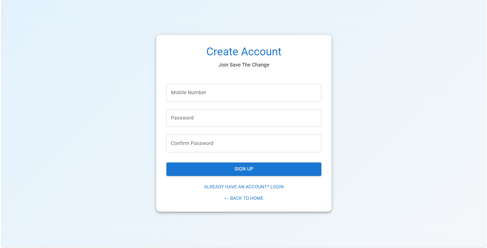

# Save The Change

## A Digital Wallet for Leftover Change

Save The Change is a full-stack web application that allows customers to save leftover change from everyday transactions and use that saved amount for metro tickets or transfer it to another customer. An administrator can manage customer wallets and add leftover change to a customer's balance.

## Live Deployment

- Frontend: https://save-the-change.up.railway.app/
- Backend API: https://save-the-change-production.up.railway.app/

## Key Features

- Customer registration and login
- Mobile-number based customer accounts
- Password validation and duplicate mobile-number protection
- Customer wallet balance
- Admin login and dashboard
- Search customers by mobile number
- Add leftover change to a customer's wallet
- Buy metro tickets using saved change
- Send saved change to another customer
- Receive change from another customer
- Transaction history
- Balance and transaction count display
- Refresh transaction data
- Logout and navigation between application sections
- React frontend connected to a Spring Boot REST API
- Persistent customer and transaction data using MySQL
- Production deployment using Railway

## Technology Stack

**Frontend:** React.js, JavaScript, Axios, React Router, Material UI

**Backend:** Java, Spring Boot, Spring Web, Spring Data JPA, REST API

**Database:** MySQL

**Deployment:** Railway (frontend, backend, and MySQL)

**Tools:** VS Code, Git, GitHub, IntelliJ IDEA, Postman

## Application Roles

### Customer

Customers can:

1. Create an account using a mobile number and password.
2. Log in to their account.
3. View their available saved change.
4. Buy metro tickets using their balance.
5. Send saved change to another registered customer.
6. Receive change from another customer.
7. View their transaction history.

### Administrator

Administrators can:

1. Log in to the administrative dashboard.
2. Search for a customer using their mobile number.
3. View the customer's current balance.
4. Add leftover change to the customer's wallet.
5. View recent transactions.

## Application Workflow

```text
                    Save The Change
                           ↓
                 Admin / Customer Login
                     ↙           ↘
                  Admin         Customer
                    ↓               ↓
            Admin Dashboard    Customer Dashboard
                    ↓               ↓
             Search Customer   View Saved Change
                    ↓               ↓
              Add Change       ┌────┴──────────────┐
                    ↓           ↓                   ↓
             Customer Wallet  Buy Metro Ticket   Send Change
                                    ↓                   ↓
                              Balance Updated     Receiver Balance
                                    └─────────┬─────────┘
                                              ↓
                                     Transaction History
```

## Customer Wallet Flow

```text
Leftover Change Added
        ↓
Customer Wallet
        ↓
   ┌────┴─────┐
   ↓          ↓
Metro Ticket  Send Change
   ↓          ↓
Balance      Receiver
Reduced      Balance Increased
   └────┬─────┘
        ↓
Transaction History
```

# Screenshots

## Home Page

The home page provides separate login options for administrators and customers.


## Customer Registration

Customers can create an account using a 10-digit mobile number and password.



## Customer Dashboard

The customer dashboard displays the available saved change, transaction count, metro ticket purchase section, and send-change section.


## Buy Metro Ticket

Customers can select a quick ticket amount or enter a custom amount and pay using their saved change.


## Send Change

Customers can transfer their saved change to another registered Save The Change customer.


## Transaction History

Customers can view money received, money sent, and change added to their wallet.


## Admin Dashboard

Administrators can search for customers, view their current balance, add change, and view recent transactions.


## Project Structure

```text
Save-The-Change/
├── backend/
│   ├── src/
│   │   └── main/
│   │       ├── java/
│   │       │   └── com/
│   │       │       └── savethechange/
│   │       │           └── backend/
│   │       │               ├── controller/
│   │       │               ├── dto/
│   │       │               ├── entity/
│   │       │               ├── repository/
│   │       │               ├── service/
│   │       │               └── BackendApplication.java
│   │       └── resources/
│   │           └── application.properties
│   └── pom.xml
│
├── frontend/
│   ├── public/
│   ├── src/
│   │   ├── pages/
│   │   │   ├── Admin/
│   │   │   ├── Customer/
│   │   │   ├── Home/
│   │   │   └── Login/
│   │   ├── App.js
│   │   └── index.js
│   └── package.json
│
└── README.md
```

## API Overview

| Endpoint | Method | Purpose |
|---|---|---|
| `/api/customer/register` | POST | Register a customer |
| `/api/customer/login` | POST | Authenticate a customer |
| `/api/customer/profile/{mobileNumber}` | GET | Retrieve customer profile |
| `/api/customer/...` | POST | Customer wallet and transaction operations |
| `/api/admin/register` | POST | Register an administrator |
| `/api/admin/login` | POST | Authenticate an administrator |
| `/api/admin/...` | POST/GET | Admin customer and wallet operations |

> The exact customer and admin operation endpoints are implemented in the corresponding Spring Boot controllers.

## Local Setup

### Prerequisites

1. Java 21
2. Node.js and npm
3. MySQL
4. Git
5. VS Code or IntelliJ IDEA

### Clone the Repository

```bash
git clone https://github.com/Srinivas5670/save-the-change.git
cd save-the-change
```

### Backend Setup

Open a terminal in the backend directory:

```bash
cd backend
```

Configure the MySQL database connection in:

```text
src/main/resources/application.properties
```

Then build the Spring Boot backend:

```bash
./mvnw clean package
```

On Windows PowerShell, if the Maven wrapper is available:

```powershell
.\mvnw.cmd clean package
```

Run the backend:

```powershell
.\mvnw.cmd spring-boot:run
```

The backend runs on:

```text
http://localhost:8080
```

### Frontend Setup

Open another terminal:

```bash
cd frontend
npm install
npm start
```

The React frontend runs on:

```text
http://localhost:3000
```

## Production Architecture

```text
                   React Frontend
                         │
                         │ HTTPS / REST API
                         ↓
                  Spring Boot Backend
                         │
                         │ JPA / JDBC
                         ↓
                       MySQL
```

The production application is deployed on Railway:

```text
React Frontend
      ↓
Railway Frontend Service
      ↓
Spring Boot REST API
      ↓
Railway Backend Service
      ↓
Railway MySQL Database
```

## Data Flow

### Adding Change

```text
Admin
  ↓
Search Customer
  ↓
Select / Enter Amount
  ↓
Spring Boot API
  ↓
MySQL
  ↓
Customer Balance Updated
  ↓
Transaction Recorded
```

### Buying a Metro Ticket

```text
Customer
  ↓
Enter Ticket Amount
  ↓
Check Available Balance
  ↓
Deduct Ticket Amount
  ↓
Update Wallet
  ↓
Record Transaction
```

### Sending Change

```text
Sender
  ↓
Enter Receiver Mobile Number
  ↓
Enter Amount
  ↓
Validate Receiver
  ↓
Check Sender Balance
  ↓
Deduct From Sender
  ↓
Add To Receiver
  ↓
Record Transactions
```

## Validation

The application includes basic validation such as:

- Mobile number must contain exactly 10 digits.
- Password must meet the minimum length requirement.
- Password and confirm password must match.
- Duplicate mobile numbers are rejected.
- Customer must exist before performing customer-specific operations.
- Wallet balance is checked before spending or transferring money.
- Transaction amounts must be valid.

## Deployment

The application is currently deployed using Railway.

### Frontend

```text
https://save-the-change.up.railway.app/
```

### Backend API

```text
https://save-the-change-production.up.railway.app/
```

The frontend communicates with the Spring Boot backend through REST API requests.

## Development and Deployment Workflow

```text
Code Changes
     ↓
VS Code
     ↓
Git
     ↓
GitHub
     ↓
Railway
     ↓
Production Deployment
     ↓
Live Application
```

## Future Enhancements

- Secure password hashing
- JWT-based authentication
- Role-based authorization
- Better transaction security
- QR-code based customer transfers
- Real metro ticket integration
- Digital ticket generation
- Mobile application
- Notifications for received and sent change
- Improved wallet and transaction analytics
- Custom domain
- Additional production security features

## Author

**Srinivas Reddy**

## License

This project is intended for educational, portfolio, and demonstration purposes.
